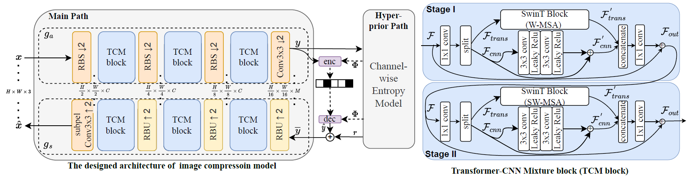
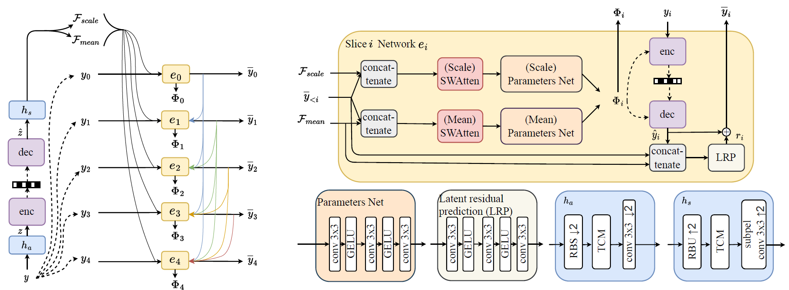
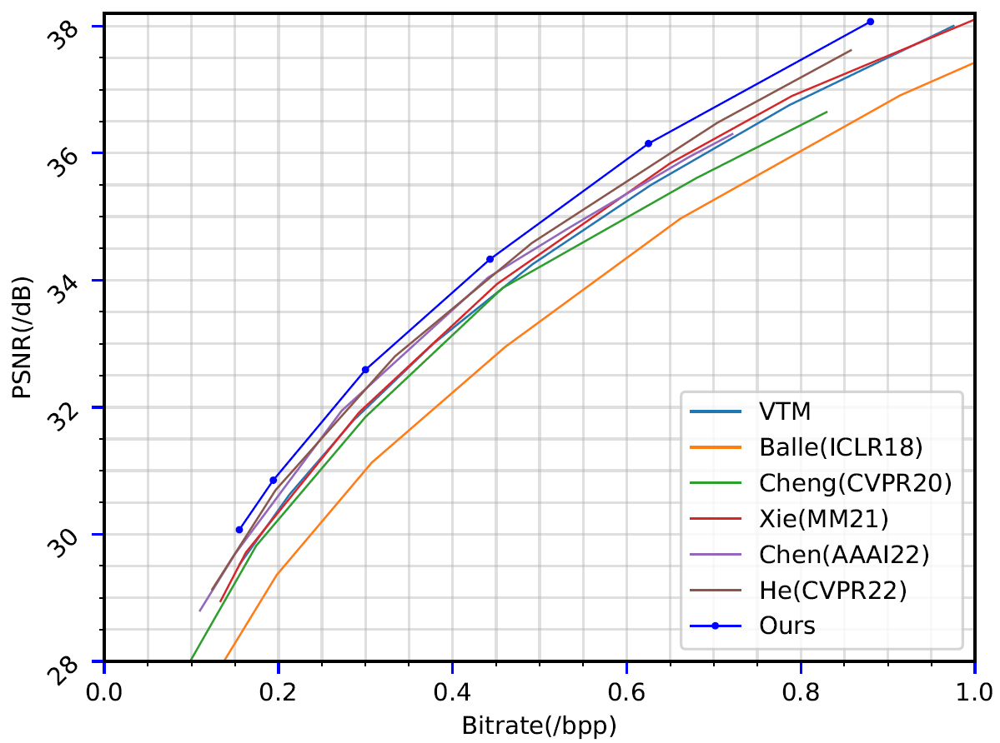
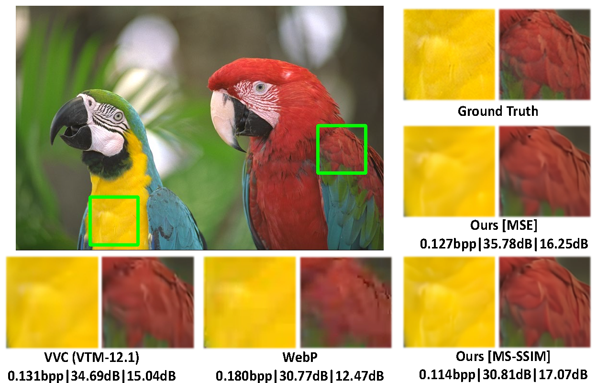

# Learned Image Compression with Mixed Transformer-CNN Architectures [CVPR23 Highlight]

This is the Pytorch repository of the paper "[Learned Image Compression with Mixed Transformer-CNN Architectures](https://arxiv.org/abs/2303.14978)".

Please feel free to contact Jinming Liu (jmliu@toki.waseda.jp) or [Heming Sun](https://sun.ynu.ac.jp/) if you have any questions.

A TensorFlow2 implementation of [LIC-TCM](https://github.com/Nikolai10/LIC-TCM) is also provided by [Nikolai10](https://github.com/Nikolai10).

## Abstract
Learned image compression (LIC) methods have exhibited promising progress and superior rate-distortion performance compared with classical image compression standards. Most existing LIC methods are Convolutional Neural Networks-based (CNN-based) or Transformer-based, which have different advantages. Exploiting both advantages is a point worth exploring, which has two challenges: 1) how to effectively fuse the two methods? 2) how to achieve higher performance with a suitable complexity? In this paper, we propose an efficient parallel Transformer-CNN Mixture (TCM) block with a controllable complexity to incorporate the local modeling ability of CNN and the non-local modeling ability of transformers to improve the overall architecture of image compression models. Besides, inspired by the recent progress of entropy estimation models and attention modules, we propose a channel-wise entropy model with parameter-efficient swin-transformer-based attention (SWAtten) modules by using channel squeezing. Experimental results demonstrate our proposed method achieves state-of-the-art rate-distortion performances on three different resolution datasets (i.e., Kodak, Tecnick, CLIC Professional Validation) compared to existing LIC methods.

## Architectures
The overall framework.



The proposed entropy model.



## Evaluation Results
RD curves on Kodak.



## Training
In the code, N refers to 1/2 of C in the paper, as it represents the number of channels used to be input into the Tensformer and CNN networks respectively. Therefore, for the Small/Middle/Large model, N should be set as 64/96/128.
``` 
CUDA_VISIBLE_DEVICES='0' python -u ./train.py -d [path of training dataset] \
    --cuda --N 128 --lambda 0.05 --epochs 50 --lr_epoch 45 48 \
    --save_path [path for checkpoint] --save \
    --checkpoint [path of the pretrained checkpoint]
```

## Testing
``` 
python eval.py --checkpoint [path of the pretrained checkpoint] --data [path of testing dataset] --cuda
```

## Pretrained Model
| N | Lambda | Metric | Link |
|--------|--------|--------|------|
| 128 | 0.05   | MSE    |   [link](https://drive.google.com/file/d/1TK-CPiD2QwtWJqZoT_OyCtnxdQ7UNP56/view?usp=share_link)   |
| 64 | 0.05   | MSE    |   [link](https://drive.google.com/file/d/1Quz6_jGJyaG6LMUbT4JuOhhQWxJN26Kh/view?usp=drive_link) |
| 64 | 0.025   | MSE    |   [link](https://drive.google.com/file/d/1rc4E2Rke1Jd8UnLq73NaXbfAdcBGGPKg/view?usp=drive_link) |
| 64 | 0.013   | MSE    |   [link](https://drive.google.com/file/d/1UbfQFsrr-Z6SrvZvpX4p1QPta5FCORZ5/view?usp=drive_link) |
| 64 | 0.0067   | MSE    |   [link](https://drive.google.com/file/d/17THA1IiPStSO6jG4h5clwkw0ySzgLZID/view?usp=drive_link) |
| 64 | 0.0035   | MSE    |   [link](https://drive.google.com/file/d/1x2rfIQAv8RsjM3zEByDdOZJtEcPU5XZT/view?usp=drive_link) |
| 64 | 0.0025   | MSE    |   [link](https://drive.google.com/file/d/1zpkW_MCkUWl8nRUlza0L7Fk7dXlXciZd/view?usp=drive_link) |


## Reconstructed Samples


## Related Works
https://github.com/ZhengxueCheng/Learned-Image-Compression-with-GMM-and-Attention

https://github.com/Googolxx/STF

https://github.com/Nikolai10/SwinT-ChARM

Noted that when our work was completed, the SwinT-ChARM did not yet have the open source code. Therefore, we use our own reproduced results in the paper. For the entropy model in the reproduced code, we use a similar setup of convolutional layers in this code.


## Notes
This implementations are not original codes of our CVPR2023 paper, because are rearranged by us. This repo is a re-implementation, but the core codes are almost the same and results are also consistent with original results. 

## Citation
```
@inproceedings{liu2023tcm,
  author = {Liu, Jinming and Sun, Heming and Katto, Jiro},
  title = {Learned Image Compression with Mixed Transformer-CNN Architectures},
  booktitle = {Proceedings of the IEEE/CVF Conference on Computer Vision and Pattern Recognition},
  pages={1--10},
  year = {2023}
}
```

